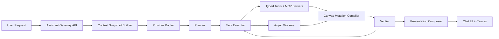

# Assistant V2 Architecture

## Purpose

This document defines the next assistant architecture for `AICanvas`.

The current implementation is mode-first:

- the client asks for `generationMode`
- the API switches between `chat`, `mermaid`, `d2`, `kanban`, `image`, and `sketch`
- the model output is converted into one artifact at a time

That is too limiting for the product direction. The next assistant must accept a native user request, decide what kind of work is needed, use tools repeatedly, coordinate multiple tasks in parallel, verify results, and only then present a composed outcome on the canvas.

## Product Direction

The target interaction looks like this:

- the user describes an outcome, not a mode
- the assistant inspects canvas context and document state
- the assistant chooses one or more providers and tools
- the assistant can run a multi-step loop: plan, act, inspect, revise, verify
- the assistant can produce multiple artifacts in one run
- the assistant can place and edit canvas objects without collisions
- the assistant can modify structured content inside markdown, kanban, and other overlays

Example request:

> Create a hero illustration for this idea, vectorize it, place it left of the current note, and add a markdown summary on the right without overlap.

That is one run with multiple dependent and parallelizable tasks. It is not a single `generationMode`.

## Design Principles

1. Provider choice is an internal routing decision, not a UI control.
2. The model never writes raw Excalidraw scene JSON.
3. All side effects happen through typed tools and typed mutations.
4. Canvas writes are deterministic, validated, and replayable.
5. Long-running work is modeled as a run with events, not a single blocking response.
6. Structured content is addressed by stable selectors, not fuzzy text spans.
7. Verification is a first-class stage in the loop, not an afterthought.

## Non-Goals

- building a fully autonomous background agent that edits canvases without explicit user intent
- exposing raw provider-specific tool APIs directly to the client
- making every provider support every capability uniformly
- storing provider-specific prompt state as the canonical run model

## Current State In This Repo

Today the standalone rebuild still uses a mode-based contract:

- `apps/web/src/components/ai-chat/AIChatPanel.tsx`
- `apps/api/src/routes/assistant.ts`
- `apps/api/src/lib/assistant/service.ts`
- `apps/api/src/lib/assistant/parsing.ts`
- `packages/shared/src/types/assistant.ts`

This document replaces that mental model with an intent-routed run architecture.

## System Overview



## Protocol Stack

The assistant should be built as a stack of internal protocols. Each layer has a clear contract and can evolve independently.

### 1. Conversation Protocol

This is the user-facing chat contract.

Client sends:

- message text
- chat/thread id
- canvas id
- context scope hints
- optional user preferences such as speed vs quality

Client does not send:

- `generationMode`
- direct provider selection
- raw tool instructions

### 2. Intent Protocol

The first model pass converts the user request into a normalized `RunSpec`.

`RunSpec` should answer:

- what outcome is requested
- what canvas or document context is required
- what artifact classes may be produced
- whether work is synchronous or async
- whether user confirmation is required before applying mutations
- what success criteria define completion

Example shape:

```ts
type RunSpec = {
  intent: 'compose_canvas_result' | 'edit_overlay' | 'research_then_build' | 'answer_only';
  userGoal: string;
  constraints: string[];
  desiredOutputs: Array<'text' | 'image' | 'vector' | 'markdown' | 'kanban' | 'prototype'>;
  applyPolicy: 'preview_first' | 'apply_safe_writes' | 'require_confirmation';
  contextNeeds: Array<'canvas' | 'selection' | 'markdown' | 'kanban' | 'assets' | 'web'>;
  successChecks: string[];
};
```

### 3. Planning Protocol

The planner converts the `RunSpec` into a task graph, not a single completion.

Each task node contains:

- task id
- semantic goal
- dependencies
- required capabilities
- preferred model lane
- required tools
- expected outputs
- verification checks

Tasks may run:

- sequentially when one output feeds another
- in parallel when they operate on independent data

### 4. Tool Protocol

All side effects and state inspection happen through typed tools.

Tool classes:

- canvas read tools
- canvas write tools
- overlay read/write tools
- asset tools
- generation tools
- retrieval tools
- verification tools

Each tool must expose:

- name
- description
- JSON schema input
- JSON schema output
- idempotency rules
- side-effect classification

This protocol should be provider-neutral. We then adapt it to OpenAI tools, Anthropic tool use, Gemini function calling, and MCP.

### 5. MCP Protocol

MCP should be the standard interface for structured context and specialized capabilities.

Recommended MCP servers:

- `canvas-mcp`
- `overlay-mcp`
- `asset-mcp`
- `search-mcp`
- `prototype-mcp`

Use MCP for:

- structured reads of canvas and overlay state
- large capability surfaces that should not live in one giant prompt
- future portability across providers and local tools

Do not require every action to flow through remote MCP. Internal server tools can still be local for low-latency operations.

### 6. Artifact Protocol

Every task produces typed artifacts. Artifacts are intermediate and final outputs.

Core artifact types:

- `assistant-text`
- `image-raster`
- `image-vector`
- `diagram-source`
- `markdown-document`
- `markdown-patch`
- `kanban-patch`
- `prototype-files`
- `layout-plan`
- `canvas-mutation-batch`
- `verification-report`

Artifacts should carry:

- artifact id
- producer task id
- type
- mime or logical subtype
- content reference or inline payload
- quality metadata
- placement hints

### 7. Selector Protocol

The assistant needs stable selectors for editing structured content.

Selectors should support:

- canvas elements by id
- overlays by element id
- markdown blocks by block id
- markdown tables by table id and cell coordinates
- kanban boards by board id
- kanban columns/cards/checklist items by stable ids
- prototype files by path

Avoid free-text selectors such as "the second heading" unless they are immediately resolved to stable ids before mutation.

### 8. Canvas Mutation Protocol

The model does not emit raw scene JSON. It emits semantic mutation requests that the compiler turns into deterministic Excalidraw or overlay updates.

Mutation classes:

- create overlay
- update overlay content
- update overlay metadata
- create asset-backed element
- reserve layout region
- place element relative to another
- align, distribute, resize, group
- attach artifact to existing overlay

Example shape:

```ts
type CanvasMutation =
  | {
      type: 'create_overlay';
      overlayType: 'markdown' | 'kanban' | 'prototype' | 'web-embed';
      contentRef: string;
      placement: PlacementSpec;
    }
  | {
      type: 'update_markdown';
      selector: { overlayId: string; blockId?: string };
      patchRef: string;
    }
  | {
      type: 'place_asset';
      assetRef: string;
      renderAs: 'image' | 'vector';
      placement: PlacementSpec;
    };
```

### 9. Run Event Protocol

Runs must stream structured events.

Event types:

- `run.created`
- `run.context_ready`
- `task.queued`
- `task.started`
- `task.tool_called`
- `task.artifact_ready`
- `task.verification_failed`
- `task.retrying`
- `task.completed`
- `run.waiting_for_confirmation`
- `run.completed`
- `run.failed`
- `run.cancelled`

Use `SSE` for the first implementation. It matches the current request-response API style better than introducing bidirectional sockets for assistant execution.

### 10. Verification Protocol

Verification is a distinct stage after significant writes and before final presentation.

Verification checks should cover:

- invalid or partial tool outputs
- markdown parse errors
- kanban id/reference errors
- layout collisions
- out-of-bounds placement
- missing assets
- vectorization quality thresholds
- prototype build failures

The verifier may:

- accept output
- request repair via a new task
- downgrade output to preview-only
- escalate for user confirmation

## Runtime Components

### 1. Assistant Gateway

Lives in `apps/api/src/routes/assistant.ts`.

Responsibilities:

- authenticate user
- accept chat/run requests
- create run records
- stream run events
- expose cancel and fetch endpoints

### 2. Context Snapshot Builder

Lives under `apps/api/src/lib/assistant/context/`.

Responsibilities:

- read current canvas and selection state
- pull relevant markdown and kanban content
- summarize large scenes into a bounded context package
- attach stable selectors for writable targets

### 3. Provider Router

Lives under `apps/api/src/lib/assistant/router/`.

Responsibilities:

- choose the best provider per task
- choose model tier by cost, speed, and capability
- fall back when a provider lacks a needed feature

Routing inputs:

- task capability requirements
- latency target
- price budget
- tool support needs
- image generation needs
- provider health

### 4. Planner

Lives under `apps/api/src/lib/assistant/planner/`.

Responsibilities:

- build the task DAG
- estimate safe concurrency
- define expected artifact contracts
- define verification checkpoints

### 5. Executor

Lives under `apps/api/src/lib/assistant/executor/`.

Responsibilities:

- run tasks in dependency order
- invoke provider adapters
- invoke tools
- persist task state
- retry transient failures

### 6. Tool Registry

Lives under `apps/api/src/lib/assistant/tools/`.

Responsibilities:

- register local tools
- expose schema metadata
- bridge MCP tool surfaces
- enforce side-effect policy

### 7. Artifact Store

Lives under `apps/api/src/lib/assistant/artifacts/`.

Responsibilities:

- store large outputs in R2 when needed
- keep metadata in D1
- provide references to raster, vector, markdown, and prototype outputs

### 8. Canvas Mutation Compiler

Lives under `apps/api/src/lib/assistant/compiler/`.

Responsibilities:

- turn semantic mutations into deterministic overlay updates
- call existing factories and registry helpers
- ensure ids, dimensions, and defaults are valid
- refuse malformed write requests

### 9. Verifier

Lives under `apps/api/src/lib/assistant/verifier/`.

Responsibilities:

- perform read-after-write checks
- compute collision and layout quality checks
- validate overlay payloads
- trigger repair tasks when needed

### 10. Presentation Composer

Lives under `apps/api/src/lib/assistant/presenter/`.

Responsibilities:

- produce the final assistant message
- attach artifact cards and mutation previews
- summarize what was done and what remains pending

## Provider Strategy

The assistant must support multiple providers behind one internal capability model.

Define providers by capability, not by brand:

- strong tool reasoning
- strong schema adherence
- native image generation
- low-cost fast routing lane
- long-context retrieval lane

Recommended role split:

- OpenAI lane: strong orchestration, structured outputs, remote MCP, reliable tool-heavy loops
- Gemini lane: low-cost multimodal tasks and native image generation flows
- Anthropic lane: high-quality planning and reasoning when tool loops are complex

This split must remain configurable. No provider should be hard-coded into the client contract.

## Proposed Shared Types

These belong in `packages/shared/src/types/assistant.ts` once implementation starts.

```ts
export type AssistantRunStatus =
  | 'queued'
  | 'planning'
  | 'running'
  | 'awaiting_confirmation'
  | 'completed'
  | 'failed'
  | 'cancelled';

export type AssistantTaskStatus =
  | 'queued'
  | 'running'
  | 'completed'
  | 'failed'
  | 'skipped';

export interface AssistantRun {
  id: string;
  chatId: string;
  canvasId: string;
  userId: string;
  status: AssistantRunStatus;
  requestText: string;
  runSpec: RunSpec;
  createdAt: string;
  updatedAt: string;
}

export interface AssistantTask {
  id: string;
  runId: string;
  kind: string;
  status: AssistantTaskStatus;
  dependsOn: string[];
  providerLane?: 'openai' | 'gemini' | 'anthropic' | 'internal';
  toolNames: string[];
  outputArtifactIds: string[];
}

export interface AssistantArtifactRecord {
  id: string;
  runId: string;
  taskId: string;
  type: string;
  title?: string;
  contentRef?: string;
  inlineContent?: string;
  metadata?: Record<string, unknown>;
}
```

## API Contract

The old `POST /assistant/chat` endpoint is not sufficient for multi-step runs.

### Keep

- chat/thread listing and persistence concepts

### Replace

- `POST /assistant/chat`

### Add

- `POST /assistant/runs`
- `GET /assistant/runs/:runId`
- `GET /assistant/runs/:runId/events`
- `POST /assistant/runs/:runId/cancel`
- `POST /assistant/runs/:runId/confirm`

### Request Shape

```json
{
  "chatId": "chat_123",
  "canvasId": "canvas_123",
  "message": "Create a visual explainer and a markdown summary beside it",
  "contextScope": "selected",
  "preferences": {
    "speed": "balanced",
    "budget": "standard",
    "applyPolicy": "preview_first"
  }
}
```

### Response Shape

```json
{
  "runId": "run_123",
  "status": "queued"
}
```

## Tool Surface

The initial local tool registry should include:

### Canvas Read

- `get_canvas_snapshot`
- `get_selection_snapshot`
- `get_canvas_layout_regions`
- `find_open_space`
- `list_canvas_assets`

### Canvas Write

- `apply_canvas_mutation_batch`
- `reserve_layout_region`
- `create_overlay`
- `place_asset_element`
- `update_element_geometry`

### Markdown

- `get_markdown_overlay`
- `get_markdown_blocks`
- `patch_markdown_blocks`
- `insert_markdown_table`
- `toggle_markdown_checklist_item`

### Kanban

- `get_kanban_board`
- `patch_kanban_board`
- `move_kanban_card`
- `create_kanban_card`
- `update_kanban_card`

### Assets

- `generate_image`
- `vectorize_raster`
- `store_asset`
- `get_asset_metadata`

### Verification

- `verify_layout_collisions`
- `verify_overlay_integrity`
- `verify_asset_quality`
- `verify_prototype_render`

## Layout And Placement Model

Placement must be explicit enough to prevent overlap and visual clutter.

`PlacementSpec` should support:

- absolute coordinates
- relative placement to an existing element
- region-based placement
- collision avoidance
- minimum spacing
- preferred dimensions
- alignment behavior

Example:

```ts
type PlacementSpec = {
  anchor?: { elementId: string; side: 'left' | 'right' | 'top' | 'bottom' };
  regionId?: string;
  offset?: { x: number; y: number };
  preferredSize?: { width: number; height: number };
  avoidElementIds?: string[];
  minGap?: number;
  fallback?: 'nearest_open_space' | 'stack_below';
};
```

## Example End-To-End Run

Request:

> Create an image for this concept, vectorize it, place it on the left, and add a markdown note on the right summarizing the idea.

Run outline:

1. `get_selection_snapshot`
2. `get_canvas_layout_regions`
3. planning task emits four tasks:
   - image generation
   - markdown drafting
   - layout planning
   - verification
4. image generation task produces `image-raster`
5. vectorization task depends on raster and produces `image-vector`
6. markdown task produces `markdown-document`
7. layout task reserves non-overlapping regions
8. compiler emits one mutation batch:
   - place vector asset in left region
   - create markdown overlay in right region
9. verifier checks:
   - no overlap
   - markdown payload valid
   - vector asset present
10. presenter emits final assistant message with:
   - what was created
   - preview artifacts
   - applied mutations

## Concurrency Rules

Parallelism is required, but only when safe.

Allow parallel tasks when:

- they only read shared state
- they produce independent artifacts
- they write to reserved, non-overlapping regions

Serialize tasks when:

- they mutate the same overlay
- they depend on a layout reservation created by another task
- they require read-after-write verification before continuing

## Persistence Model

Persist these records:

- chats
- messages
- runs
- tasks
- artifacts
- run events

Store in D1:

- metadata
- status
- lightweight structured payloads

Store in R2:

- large raster images
- vectors
- prototype bundles
- large markdown exports if needed

## Safety And Guardrails

Rules:

- read-only tools are allowed by default
- destructive writes require an explicit safe-write policy
- large scene rewrites should require confirmation
- provider adapters must redact secrets before model invocation
- tools must log side effects and produce structured audit entries

## Testing Strategy

Add tests at four layers:

1. planner tests
2. tool schema and tool execution tests
3. compiler and verifier tests
4. end-to-end run tests with provider mocks

Critical regression suites:

- markdown patch targeting
- kanban card moves and updates
- layout collision avoidance
- multi-artifact parallel runs
- retry after verification failure
- provider fallback when a capability is unavailable

## Migration Plan

### Phase 1: Contract Preparation

- keep the current chat UI
- deprecate `generationMode` in shared types
- introduce `runId`, `run status`, and event streaming
- add new server-side run entities without removing old routes yet

### Phase 2: Tool Registry And Context Snapshot

- add local tool registry
- add context snapshot builder
- expose markdown and kanban selectors
- keep using one provider initially behind the new execution contract

### Phase 3: Planner + Executor

- replace mode switching with `RunSpec` and task graph generation
- support repeated tool use and verification loops
- move image/vector flows into the same run pipeline

### Phase 4: Multi-Provider Routing

- add provider adapters
- add capability-aware routing
- add cost and latency policies

### Phase 5: Parallel Multi-Artifact Composition

- support one run producing several artifacts and one mutation batch
- add layout reservation and collision verification
- support coordinated image + markdown + kanban outcomes

### Phase 6: Remove Legacy Mode-First Path

- remove mode dropdown from UI
- remove old parsing helpers that assume one artifact type
- retire the old `/assistant/chat` implementation

## Recommended Repo Changes

Add these folders during implementation:

```text
apps/api/src/lib/assistant/
  artifacts/
  compiler/
  context/
  executor/
  planner/
  presenter/
  router/
  runs/
  tools/
  verifier/
  providers/
```

Update these existing areas:

- `apps/api/src/routes/assistant.ts`
- `apps/api/src/lib/assistant/types.ts`
- `packages/shared/src/types/assistant.ts`
- `packages/shared/src/schemas/assistant.ts`
- `apps/web/src/components/ai-chat/AIChatPanel.tsx`
- `apps/web/src/stores/slices/chatSlice.ts`

## Recommended First Implementation Slice

The safest first slice is:

1. replace `generationMode` with a single freeform request path
2. add `run` records and SSE events
3. support a planner with only three task kinds:
   - answer-only
   - create-markdown
   - create-image-plus-markdown
4. add layout reservation and collision verification
5. keep provider routing simple at first

That gets the product onto the correct architecture without requiring the entire system in one pass.

## Decision Summary

The assistant should be rebuilt as an intent-routed run engine with:

- typed tools
- MCP-backed structured context
- multi-provider routing
- artifact-driven execution
- deterministic canvas mutation compilation
- read-after-write verification
- parallel task support where safe

That architecture matches the product goal far better than extending the current mode dropdown.
